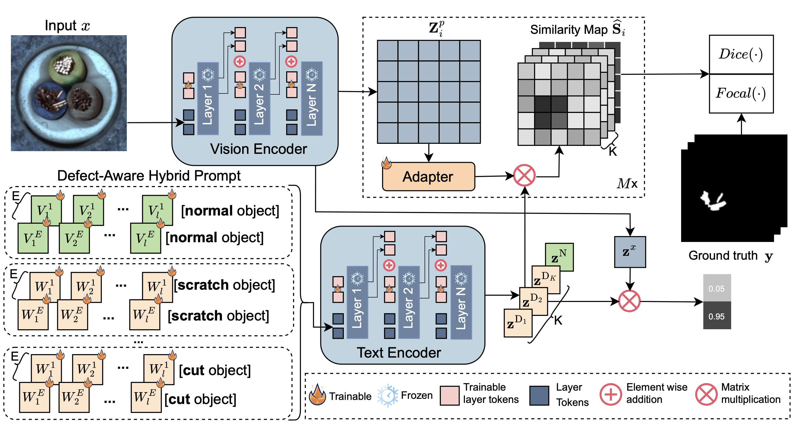

# DAPO: Defect-aware Prompt Optimization for Multi-type Anomaly Detection and Segmentation

## Table of Contents
- [DAPO: Defect-aware Prompt Optimization for Multi-type Anomaly Detection and Segmentation](#dapo-defect-aware-prompt-optimization-for-multi-type-anomaly-detection-and-segmentation)
  - [Table of Contents](#table-of-contents)
  - [Purpose of the project](#purpose-of-the-project)
  - [Introduction](#introduction)
  - [Installation](#installation)
    - [Environment](#environment)
  - [Train your own weights](#train-your-own-weights)
  - [Testing](#testing)
    - [Anomaly Detection and Segmentation under Distribution Shift](#anomaly-detection-and-segmentation-under-distribution-shift)
    - [Anomaly Detection for a single image](#anomaly-detection-for-a-single-image)
    - [Zero-shot Multi-type Defect Segmentation](#zero-shot-multi-type-defect-segmentation)


## Purpose of the project
This software is a research prototype, solely developed for and published as part of the publication [DAPO: Defect-aware Prompt Optimization for Multi-type Anomaly Detection and Segmentation](https://www.arxiv.org/abs/2512.09446). 

## Introduction


We introduce **DAPO**, a novel approach for Defect-aware Prompt Optimization based on progressive tuning for the zero-shot multi-type and binary anomaly detection and segmentation under distribution shifts. Our approach aligns anomaly-relevant image features with their corresponding text semantics by learning defect-aware prompts and introducing additional learnable tokens, without modifying the pre-trained model's parameters.


## Installation

### Environment

1. **Clone this repo**  
   ```bash
   git clone https://github.com/<username>/<project>.git
   cd <project>

2. **Create & activate a conda environment**
    ```bash
    conda create -n <env> python=3.10
    conda activate <env>
    ```
3. **Install packages from requirement files**
    ```bash
      pip install -r .\requirements.txt --index-url https://pypi.org/simple  --extra-index-url https://download.pytorch.org/whl/cu118
    ```

### Datasets
Please download the datasets used in the experiments:
- MVTec-AD
- VisA
- MPDD
- Real-IAD
- MAD

Organize them under a `./data/` directory as follows:
```
data/
  mvtec/
  visa/
  mpdd/
  real_iad/
  mad/
```

### Run pre-trained model
```bash
python test.py \
  --dataset <dataset_name> \
  --test_data_path <your_test_data_path> 
```

## Train your own weights
```bash
python train.py \
  --dataset mvtec \
  --train_data_path ./data/mvtec \
  --checkpoint_dir ./checkpoint/ \
  --epoch 5 --batch_size 8 --learning_rate 0.001 \
  --image_size 518 --model_name "ViT-L-14-336-quickgelu" \
  --depth 24 --prefix_token_cnt 4 \
  --text_depth 12 --normal_token_cnt 5 --abnormal_token_cnt 5 --prompt_count 10 --layer_token_cnt 4
```

## Testing

When testing on a **new dataset** not included above, make sure to update the argument parameter by adding `defect_type` (e.g., `hole`, `scratch`, `contamination`) as below:

```bash
--defect_types crack hole damaged contamination \
```

### Anomaly Detection and Segmentation under Distribution Shift
```bash
python test.py \
  --dataset visa \
  --test_data_path ./data/visa \
  --metrics 
  --save_path ./results/ \
  --checkpoint_path ./checkpoint/ \
  --epoch 1 --batch_size 1 --learning_rate 0.001 \
  --image_size 518 --model_name "ViT-L-14-336-quickgelu" \
  --depth 24 --prefix_token_cnt 4 \
  --text_depth 12 --normal_token_cnt 5 --abnormal_token_cnt 5 --prompt_count 10 --layer_token_cnt 4
```

### Anomaly Detection for a single image
```bash
python test.py \
    --inference_mode \
    --image_path ./data/image.png \
    --checkpoint_path ./checkpoint/ \
    --epoch 0 \
    --save_path ./results/ 
```

### Zero-shot Multi-type Defect Segmentation
```bash
python test_multi_defect.py \
  --dataset real_iad \
  --data_path ./data/real_iad \
  --save_path ./results/rea_iad_multi_type_seg/zero_shot/ \
  --checkpoint_path ./checkpoint/ \
  --model_name "ViT-L-14-336-quickgelu" \
  --image_size 518
```